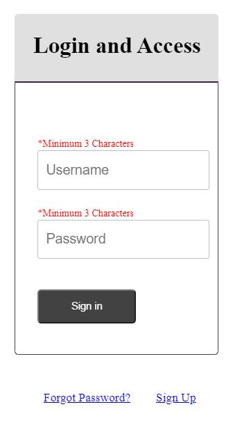
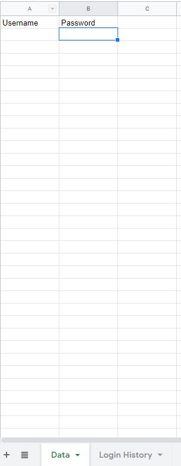
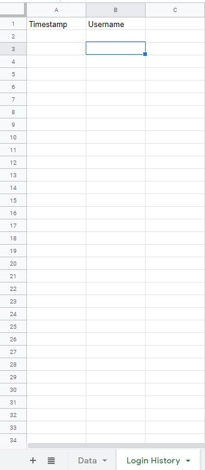
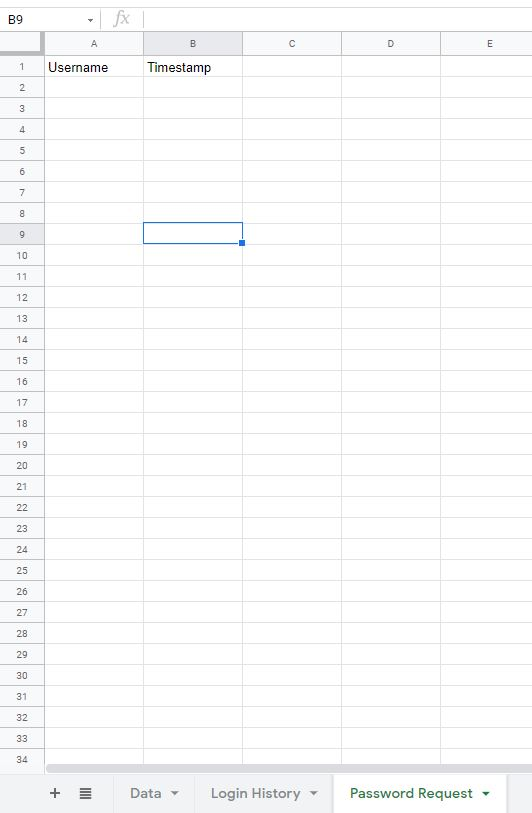
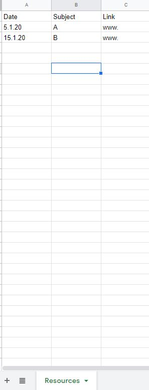

# Login and Access
The web app allows to access data from google sheet through a login system. The app is designed to access study resources. The app is embedded to another site. So, the dimensions are adjusted to the webpage contents.  

# Structure of the System

## App
The Google Apps Script has a mandatory file <i>Code.gs</i>. This has the `doGet(e)` function which is the main driver of the app. The code is similar to javascript. The <i>.gs</i> file helps in communicating with the google sheet. All other files are html. In fact, the javascript files (files named with JS in the repository) are saved as html. 

## Google Sheet
The login form takes the username and password, matches with the datasheet and keeps the record in the login history sheet. If anyone forgets password, he can request through the "Forgot Password" option. The details will be stored on the password requeset sheet. The datasheet, login history and password request datasheet are as follows:  

<table>
  <tr>
    <td></td>
    <td></td>
    <td></td>
    </tr>
</table>
 
The resource file has three columns. The rows will be the output after successful login. 
  

